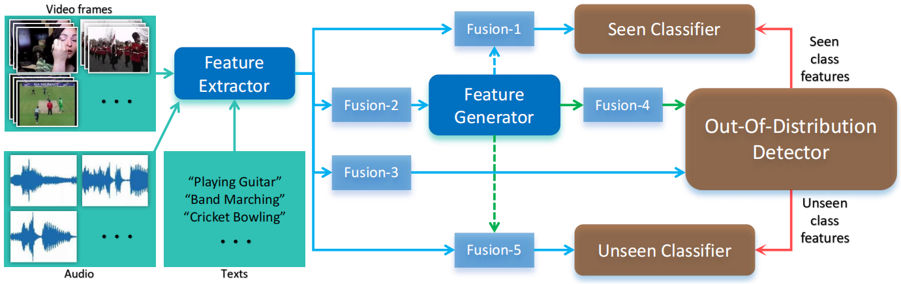

# AV-OOD-GZSL
This is the official implementation of my paper: Audio-Visual Out-Of-Distribution for Generalized Zero-shot Learning, which has been accepted to the The 35th British Machine Vision Conference ([BMVC2024](https://bmvc2024.org/))

## Downloading Dataset
We adopted the same dataset as AVCA-GZSL, which can be found in [here](https://github.com/ExplainableML/AVCA-GZSL?tab=readme-ov-file#downloading-our-features).

The unzipped files should be placed in the `avgzsl_benchmark_datasets/` folder in the root directory of the project.

## Training and Testing
To train and test the model, run the following command:
    
    python main.py config/ucf_test.yaml>
    python main.py config/activity_test.yaml>
    python main.py config/vgg_test.yaml>

or simply run the `run_avood.sh` script.
